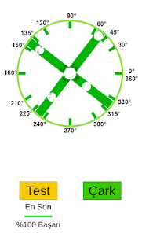
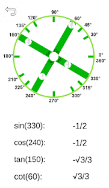
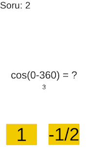
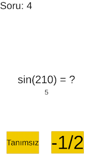

# Trigonometri Çarkı
This is my school project 📘

## Here some screenshots 📱
          

## Features
+The goal is remembering familiar trigonometric values by interesting table  
+App has a quiz system for practicing your knowledge

